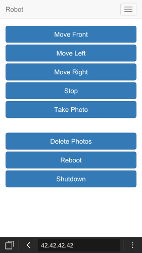

### Hardware you need

1. **RaspberryPi** (A+ is the best option but should work with B,B+)
2. **RaspberryPi Camera module**
3. **Micro SD Card** 
4. **USB Wifi dongle**
5. **Piface digital** - [Piface](http://www.piface.org.uk/products/piface_digital/) can be replaced with arduino / hat / relay, but the code of the robot should be adapted
6. **Portable battery** with microUSB for RaspberryPi power, you will need more power if using other RaspberryPi than A+
7. **Rover kit** any similar kit to [this](http://www.active-robots.com/4wd-atv-robot-chassis-kit) should work fine

## First steps

This tutorial will work with raspbian-wheezy, you can download this from [here](https://downloads.raspberrypi.org/raspbian/images/raspbian-2015-05-07/2015-05-05-raspbian-wheezy.zip), is not working with jessie yet...

Make a clean install of raspbian-wheezy on your sdcard, instructions [here](https://www.raspberrypi.org/documentation/installation/installing-images/). 
For the first steps you will need a TV or monitor with HDMI, USB keyboard, USB mouse and the USB Wifi dongle connected.

In the first boot in raspi-config expand file system, enable ssh, camera module and piface (SPI), also change hostname from raspberrypi to nodebot.

Execute this command:

	sudo nano /etc/wpa_supplicant/wpa_supplicant.conf

at the end add wifi configuration like this:

	network={
		ssid="wifi_name"
		psk="wifi_password"
	}

save and exit

	sudo reboot

After reboot, check raspberrypi_ip with this command: 

	ifconfig

In your computer you can connect via ssh:

	ssh pi@raspberrypi_ip
	password: raspberry

Now you can disconnect TV or monitor, USB keyboard and USB mouse, just leave the USB Wifi dongle.

Upgrade system with these commands:

	sudo apt-get update && sudo apt-get -y upgrade && sudo rpi-update
	sudo nano /boot/cmdline.txt

At the end of the line add one space and: 

	cgroup_enable=memory

Make a virtual partition used by camera streaming, execute this commands:

	sudo mkdir /ram
	sudo nano /etc/fstab

Add this line:

	tmpfs /ram tmpfs nodev,nosuid,size=1M 0 0 

Save, exit and then execute this commands:

	sudo mount -a

Reboot:

	sudo reboot

## Install software

Dependencies for [piface-node](https://github.com/darrylhodgins/piface-node#get-the-piface-c-libraries):

	sudo apt-get -y install automake libtool git
	git clone https://github.com/thomasmacpherson/piface.git
	cd piface/c
	./autogen.sh && ./configure && make && sudo make install
	sudo ldconfig
	cd ../scripts
	sudo ./spidev-setup

Reboot:

	sudo reboot

Install [NodeJs](https://nodejs.org/en/) 0.10.36, yes is an old version but this is compatible with piface-node:

	wget http://node-arm.herokuapp.com/node_0.10.36_armhf.deb
	sudo dpkg -i node_0.10.36_armhf.deb

Clone Nodebot-Rover repository and install:

	git clone https://github.com/sergioaraki/Nodebot-Rover.git
	sudo mv /home/pi/Nodebot-Rover/Robot /home/pi/Robot
	cd Robot
	npm install
	cd ..

Install [PM2](http://pm2.keymetrics.io/) this will run the Nodebot code at boot and keep running:

	sudo npm install pm2@latest -g --unsafe-perm
	pm2 startup ubuntu

Pay attention it should ask you to run another command, copy, paste and run that command
Lets config the Nodebot code in PM2:

	pm2 start /home/pi/Robot/process.json
	pm2 save

## RaspberryPi as access point

Execute this commands:
	
	sudo apt-get -y install hostapd isc-dhcp-server
	sudo nano /etc/dhcp/dhcpd.conf

Comment this 2 lines:

	#option domain-name "example.org";
	#option domain-name-servers ns1.example.org, ns2.example.org;

And add this at the end of the file:

	authoritative;

	subnet 192.168.42.0 netmask 255.255.255.0 { 
	  range 192.168.42.10 192.168.42.50;
	  option broadcast-address 192.168.42.255; option routers 192.168.42.1; default-lease-time 600;
	  max-lease-time 7200;
	  option domain-name "local";
	  option domain-name-servers 8.8.8.8, 8.8.4.4;
	}

Save, exit and then execute this command:

	sudo nano /etc/default/isc-dhcp-server

Modify the last line:

	INTERFACES="wlan0"

Save, exit and then execute this commands:

	sudo ifdown wlan0
	sudo nano /etc/network/interfaces

And left this file like this:

	auto lo
	iface lo inet loopback

	auto eth0
	allow-hotplug eth0
	iface eth0 inet dhcp

	allow-hotplug wlan0
	iface wlan0 inet static
	address 192.168.42.1
	netmask 255.255.255.0

Save, exit and then execute this commands:

	sudo ifconfig wlan0 192.168.42.1
	sudo nano /etc/hostapd/hostapd.conf

And left this file like this (unless you want to change ssid and password):

	interface=wlan0
	driver=rtl871xdrv
	ssid=Nodebot
	hw_mode=g
	channel=6
	macaddr_acl=0
	auth_algs=1
	ignore_broadcast_ssid=0
	wpa=2
	wpa_passphrase=password
	wpa_key_mgmt=WPA-PSK
	wpa_pairwise=TKIP
	rsn_pairwise=CCMP

Save, exit and then execute this command:

	sudo nano /etc/default/hostapd

At the end of the file add this line:

	DAEMON_CONF="/etc/hostapd/hostapd.conf"

Save, exit and then execute this command:

	sudo nano /etc/sysctl.conf

Uncomment this line:

	net.ipv4.ip_forward=1

Save, exit and then execute this commands:

	sudo sh -c "echo 1 > /proc/sys/net/ipv4/ip_forward"
	sudo iptables -t nat -A POSTROUTING -o eth0 -j MASQUERADE
	sudo iptables -A FORWARD -i eth0 -o wlan0 -m state --state RELATED,ESTABLISHED -j ACCEPT
	sudo iptables -A FORWARD -i wlan0 -o eth0 -j ACCEPT
	sudo sh -c "iptables-save > /etc/iptables.ipv4.nat"
	sudo nano /etc/network/interfaces

At the end of the file add this line:

	up iptables-restore < /etc/iptables.ipv4.nat

Save, exit and then execute this commands:

	sudo wget http://www.daveconroy.com/wp3/wp-content/uploads/2013/07/hostapd.zip
	sudo unzip hostapd.zip 
	sudo mv /usr/sbin/hostapd /usr/sbin/hostapd.old
	sudo mv hostapd /usr/sbin/hostapd
	sudo chown root.root /usr/sbin/hostapd
	sudo chmod 755 /usr/sbin/hostapd
	sudo service hostapd start
	sudo service isc-dhcp-server start
	sudo update-rc.d hostapd enable
	sudo update-rc.d isc-dhcp-server enable

If your wifi dongle requires 8188eu drivers, check this [post](https://www.raspberrypi.org/forums/viewtopic.php?p=462982) and follow instructions to install them

Execute this command:

	sudo nano /etc/wpa_supplicant/wpa_supplicant.conf

remove the wifi configuration added at the beginning, save, exit and reboot:

	sudo reboot

At this point you cannot connect to the RaspberryPi in your wifi, now you need to connect to the Nodebot wifi in your computer or smartphone and access in your browser to: http://192.168.42.1:3000 and get control of your nodebot.

When the Nodebot is up and running, use the shutdown button on first screen of the web or piface's S0 switch to shutdown the RaspberryPi and avoid damage the SDCard.

## Piface

If the wifi fails you can use Piface switchs to execute some actions:

1. S3 will close relays and stop motors
2. S2 will take a photo
3. S1 will reboot the RaspberryPi 
4. S0 will shutdown the RaspberryPi

## Optional

If you have a Mac (in Windows this maybe works out of the box) and a Microsoft Xbox 360 controller, you can install this [driver](https://github.com/360Controller/360Controller) and you will have joystick support in your Mac.

## Tools used

Robot code:

[express](http://expressjs.com/)
[raspicam](https://www.npmjs.com/package/raspicam)
[piface-node](https://www.npmjs.com/package/piface-node)
[socket.io](http://socket.io/)
[levelup](https://www.npmjs.com/package/levelup)

Web controller:

[Bootstrap](http://getbootstrap.com/)
[Bootstrap-dialog](https://nakupanda.github.io/bootstrap3-dialog/)
[nippleJS](http://yoannmoinet.github.io/nipplejs/)
[directorySlider](https://github.com/justinwhall/directorySlider)
[HTML5 Gamepad API](https://developer.mozilla.org/en-US/docs/Web/API/Gamepad_API/Using_the_Gamepad_API)

## Known issue

Sometimes when the RaspberryPi boot the "router mode" fails and you can't connect with the Nodebot wifi, just restart the RaspberryPi and try again.